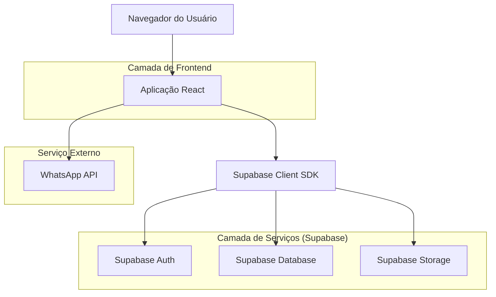
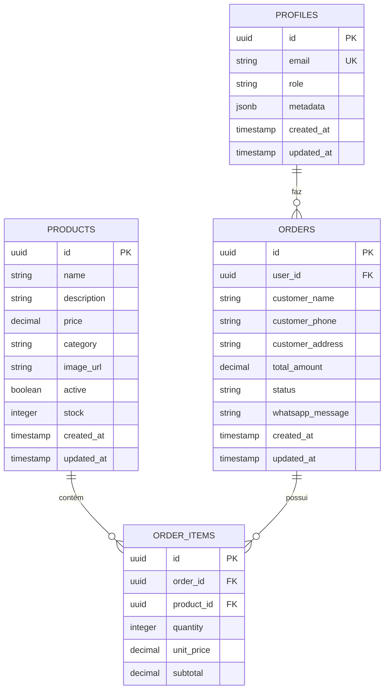

## 1. Arquitetura do Sistema



## 2. Tecnologias Utilizadas

- **Frontend**: React@18 + TypeScript + Vite
- **Estilização**: Tailwind CSS@3 + Shadcn/ui
- **Ícones**: Lucide React
- **Gerenciamento de Estado**: TanStack Query
- **Formulários**: React Hook Form + Zod
- **Backend**: Supabase (BaaS)
- **Inicialização**: vite-init

## 3. Definições de Rotas

| Rota | Propósito |
|-------|---------|
| / | Página inicial com catálogo de produtos |
| /checkout | Página de checkout com formulário de pedido |
| /admin | Dashboard administrativo (protegido) |
| /admin/produtos | Gestão de produtos |
| /admin/pedidos | Visualização e gestão de pedidos |

## 4. Modelo de Dados

### 4.1 Definição do Modelo de Dados



### 4.2 Definição de Tabelas (DDL)

**Tabela de Perfis (profiles)**
```sql
-- Criar tabela de perfis
CREATE TABLE profiles (
    id UUID PRIMARY KEY DEFAULT gen_random_uuid(),
    email VARCHAR(255) UNIQUE NOT NULL,
    role VARCHAR(20) DEFAULT 'customer' CHECK (role IN ('customer', 'admin')),
    metadata JSONB DEFAULT '{}',
    created_at TIMESTAMP WITH TIME ZONE DEFAULT NOW(),
    updated_at TIMESTAMP WITH TIME ZONE DEFAULT NOW()
);

-- Criar índices
CREATE INDEX idx_profiles_email ON profiles(email);
CREATE INDEX idx_profiles_role ON profiles(role);
```

**Tabela de Produtos (products)**
```sql
-- Criar tabela de produtos
CREATE TABLE products (
    id UUID PRIMARY KEY DEFAULT gen_random_uuid(),
    name VARCHAR(255) NOT NULL,
    description TEXT,
    price DECIMAL(10,2) NOT NULL CHECK (price >= 0),
    category VARCHAR(50) NOT NULL,
    image_url TEXT,
    active BOOLEAN DEFAULT true,
    stock INTEGER DEFAULT 0 CHECK (stock >= 0),
    created_at TIMESTAMP WITH TIME ZONE DEFAULT NOW(),
    updated_at TIMESTAMP WITH TIME ZONE DEFAULT NOW()
);

-- Criar índices
CREATE INDEX idx_products_category ON products(category);
CREATE INDEX idx_products_active ON products(active);
CREATE INDEX idx_products_price ON products(price);
```

**Tabela de Pedidos (orders)**
```sql
-- Criar tabela de pedidos
CREATE TABLE orders (
    id UUID PRIMARY KEY DEFAULT gen_random_uuid(),
    user_id UUID REFERENCES profiles(id),
    customer_name VARCHAR(255) NOT NULL,
    customer_phone VARCHAR(20) NOT NULL,
    customer_address TEXT NOT NULL,
    total_amount DECIMAL(10,2) NOT NULL CHECK (total_amount >= 0),
    status VARCHAR(20) DEFAULT 'pending' CHECK (status IN ('pending', 'confirmed', 'delivered', 'cancelled')),
    whatsapp_message TEXT,
    created_at TIMESTAMP WITH TIME ZONE DEFAULT NOW(),
    updated_at TIMESTAMP WITH TIME ZONE DEFAULT NOW()
);

-- Criar índices
CREATE INDEX idx_orders_user_id ON orders(user_id);
CREATE INDEX idx_orders_status ON orders(status);
CREATE INDEX idx_orders_created_at ON orders(created_at DESC);
```

**Tabela de Itens do Pedido (order_items)**
```sql
-- Criar tabela de itens do pedido
CREATE TABLE order_items (
    id UUID PRIMARY KEY DEFAULT gen_random_uuid(),
    order_id UUID REFERENCES orders(id) ON DELETE CASCADE,
    product_id UUID REFERENCES products(id),
    quantity INTEGER NOT NULL CHECK (quantity > 0),
    unit_price DECIMAL(10,2) NOT NULL CHECK (unit_price >= 0),
    subtotal DECIMAL(10,2) NOT NULL CHECK (subtotal >= 0)
);

-- Criar índices
CREATE INDEX idx_order_items_order_id ON order_items(order_id);
CREATE INDEX idx_order_items_product_id ON order_items(product_id);
```

## 5. Políticas de Segurança (RLS)

### 5.1 Políticas de Acesso

**Tabela products**
```sql
-- Permitir leitura pública para todos os produtos ativos
CREATE POLICY "Permitir leitura pública de produtos ativos" ON products
    FOR SELECT USING (active = true);

-- Permitir leitura de todos os produtos para usuários autenticados
CREATE POLICY "Permitir leitura total para autenticados" ON products
    FOR SELECT TO authenticated USING (true);

-- Permitir gerenciamento completo para admin
CREATE POLICY "Permitir gerenciamento completo para admin" ON products
    FOR ALL TO authenticated USING (
        EXISTS (
            SELECT 1 FROM profiles 
            WHERE profiles.id = auth.uid() 
            AND profiles.role = 'admin'
        )
    );
```

**Tabela orders**
```sql
-- Usuários podem criar seus próprios pedidos
CREATE POLICY "Usuários podem criar pedidos" ON orders
    FOR INSERT TO authenticated WITH CHECK (auth.uid() = user_id);

-- Usuários podem ver seus próprios pedidos
CREATE POLICY "Usuários podem ver seus pedidos" ON orders
    FOR SELECT TO authenticated USING (auth.uid() = user_id);

-- Admin pode ver todos os pedidos
CREATE POLICY "Admin pode ver todos os pedidos" ON orders
    FOR SELECT TO authenticated USING (
        EXISTS (
            SELECT 1 FROM profiles 
            WHERE profiles.id = auth.uid() 
            AND profiles.role = 'admin'
        )
    );

-- Admin pode atualizar status dos pedidos
CREATE POLICY "Admin pode atualizar pedidos" ON orders
    FOR UPDATE TO authenticated USING (
        EXISTS (
            SELECT 1 FROM profiles 
            WHERE profiles.id = auth.uid() 
            AND profiles.role = 'admin'
        )
    ) WITH CHECK (true);
```

**Tabela order_items**
```sql
-- Permitir leitura de itens dos próprios pedidos
CREATE POLICY "Ver itens dos próprios pedidos" ON order_items
    FOR SELECT TO authenticated USING (
        EXISTS (
            SELECT 1 FROM orders 
            WHERE orders.id = order_items.order_id 
            AND orders.user_id = auth.uid()
        )
    );

-- Admin pode ver todos os itens
CREATE POLICY "Admin pode ver todos os itens" ON order_items
    FOR SELECT TO authenticated USING (
        EXISTS (
            SELECT 1 FROM profiles 
            WHERE profiles.id = auth.uid() 
            AND profiles.role = 'admin'
        )
    );
```

## 6. Configurações de Storage

**Bucket de Imagens**: Criar bucket "products" para armazenar imagens dos produtos com políticas públicas de leitura.

## 7. Integrações Externas

### WhatsApp Business API
- Envio de mensagens com detalhes do pedido
- Formatação automática da mensagem com itens, valores e dados do cliente
- Link direto para WhatsApp Web/Desktop

## 8. Migração dos Dados Mockados

### Estratégia de Migração
1. Exportar MOCK_PRODUCTS para CSV
2. Fazer upload via dashboard do Supabase
3. Mapear campos do mock para schema real
4. Atualizar componentes React para usar hooks do Supabase
5. Implementar loading states e error handling

## 9. Considerações de Performance

- Implementar TanStack Query para cache de dados
- Paginação de produtos (limite de 20 por página)
- Lazy loading de imagens
- Otimização de queries com índices apropriados
- Debounce em buscas e filtros