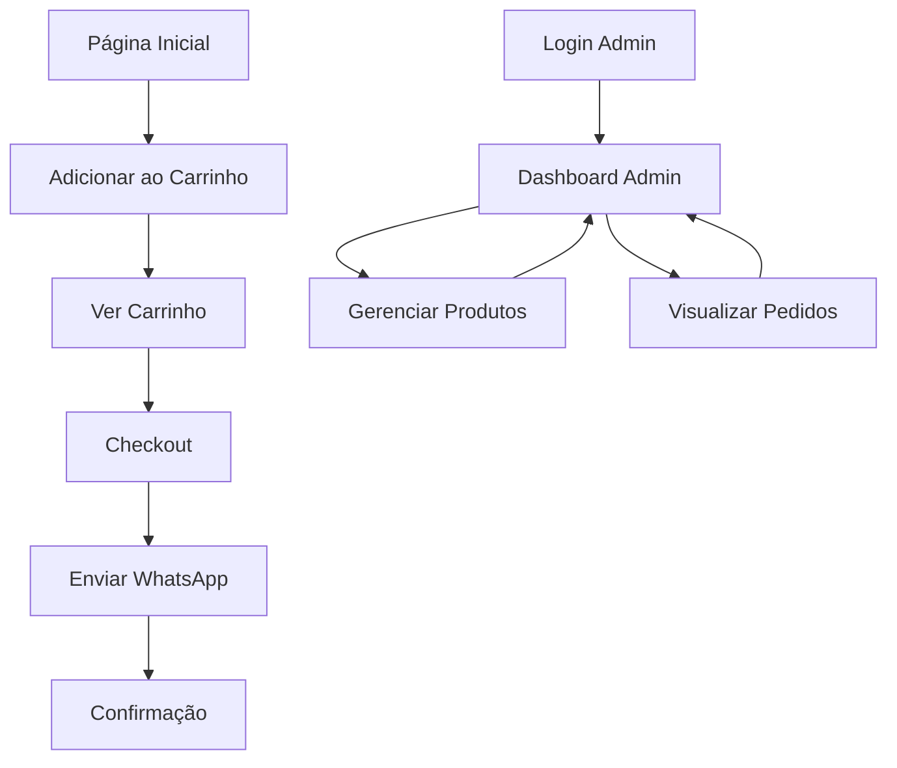

## 1. Visão Geral do Produto

O Trezentos Connect é um e-commerce especializado para barbearias, permitindo que estabelecimentos vendam produtos para cuidados masculinos online. A plataforma conecta barbearias com clientes finais, facilitando a venda de produtos como pomadas, shampoos, máquinas de cortar cabelo e acessórios.

O produto resolve o problema de barbearias que precisam diversificar suas receitas além dos serviços de corte e barba, oferecendo uma solução completa de vendas online com gestão de pedidos e estoque.

## 2. Funcionalidades Principais

### 2.1 Papéis de Usuário

| Papel | Método de Registro | Permissões Principais |
|------|---------------------|------------------|
| Cliente | Navegação anônima | Visualizar produtos, adicionar ao carrinho, finalizar pedido |
| Admin | Senha hardcoded (temporário) | Gerenciar produtos, visualizar pedidos, atualizar status |

### 2.2 Módulos de Funcionalidades

O e-commerce consiste nas seguintes páginas principais:
1. **Página Inicial**: catálogo de produtos, carrinho de compras, navegação.
2. **Checkout**: resumo do pedido, formulário de contato, envio via WhatsApp.
3. **Admin**: gestão de produtos, visualização de pedidos, atualização de status.

### 2.3 Detalhes das Páginas

| Nome da Página | Módulo | Descrição da Funcionalidade |
|-----------|-------------|---------------------|
| Página Inicial | Catálogo de Produtos | Exibir grade de produtos com imagem, nome, preço e botão adicionar. Produtos organizados por categorias (cabelo, barba, acessórios) |
| Página Inicial | Carrinho de Compras | Sidebar flutuante que lista itens adicionados, quantidade editável, valor total calculado automaticamente |
| Página Inicial | Navegação | Header com logo, ícone do carrinho com badge de quantidade, filtros por categoria |
| Checkout | Resumo do Pedido | Listar todos os itens, quantidades, preços unitários e total geral. Informações de contato do cliente |
| Checkout | Formulário | Campos para nome, telefone, endereço de entrega. Validação de campos obrigatórios |
| Checkout | Confirmação | Envio dos dados para WhatsApp da barbearia com todos os detalhes do pedido. Mensagem pré-formatada |
| Admin | Gestão de Produtos | Listar todos os produtos, adicionar novo produto, editar informações existentes, definir disponibilidade |
| Admin | Gestão de Pedidos | Visualizar todos os pedidos com status (pendente, enviado, entregue), filtrar por data/status, marcar como processado |
| Admin | Autenticação | Login simples com senha hardcoded (temporário até implementação do Supabase Auth) |

## 3. Fluxo Principal

### Fluxo do Cliente
1. Usuário acessa a página inicial e visualiza o catálogo de produtos
2. Adiciona produtos desejados ao carrinho
3. Clica no ícone do carrinzo para revisar os itens
4. Procede para o checkout informando dados de contato
5. Confirma o pedido que é enviado via WhatsApp para a barbearia
6. Recebe confirmação visual do envio

### Fluxo do Admin
1. Admin acessa página de login e autentica com senha
2. Visualiza dashboard com pedidos recentes e produtos
3. Gerencia estoque e disponibilidade de produtos
4. Processa pedidos recebidos e atualiza status
5. Acompanha métricas de vendas

## 4. Interface do Usuário

### 4.1 Estilo de Design
- **Cores Primárias**: Preto e branco (estilo barbearia clássica)
- **Cores Secundárias**: Dourado/bronze para detalhes
- **Botões**: Estilo arredondado com hover effects
- **Tipografia**: Fonte sans-serif moderna (Inter ou similar)
- **Layout**: Baseado em cards com sombras suaves
- **Ícones**: Lucide React para consistência

### 4.2 Visão Geral das Páginas

| Nome da Página | Módulo | Elementos de UI |
|-----------|-------------|-------------|
| Página Inicial | Header | Logo centralizada, menu hamburger, ícone carrinho com badge circular mostrando quantidade |
| Página Inicial | Catálogo | Grid responsivo 3 colunas (desktop), cards com imagem 16:9, nome em negrito, preço destacado, botão "Adicionar" verde |
| Página Inicial | Carrinho | Sidebar slide-in da direita, header com título e X para fechar, lista scrollável, footer com total e botão checkout |
| Checkout | Formulário | Inputs com bordas arredondadas, labels acima, validação em tempo real, botão submit primário |
| Admin | Dashboard | Tabela de dados com zebra striping, botões de ação ícones, cards de métricas no topo |

### 4.3 Responsividade
- Desktop-first approach
- Breakpoints: 1024px (tablet), 768px (mobile)
- Menu hamburger para mobile
- Grid de produtos adaptável (3 colunas desktop, 2 tablet, 1 mobile)
- Carrinho se torna fullscreen em mobile

### 4.4 Integração com Supabase
O sistema será migrado de dados mockados para Supabase com:
- Tabela de produtos com imagens armazenadas em storage
- Tabela de pedidos com status tracking
- Tabela de itens do pedido para relacionamento N:N
- Sistema de autenticação para substituir senha hardcoded